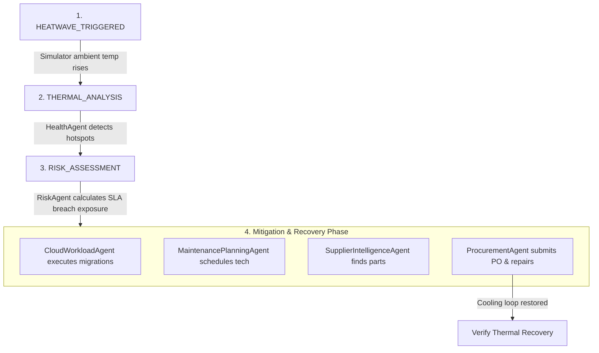

# Adaptive Infrastructure Resilience MCP (AIR-MCP)

Adaptive Infrastructure Resilience MCP (**AIR-MCP**) is a production-inspired, autonomous decision orchestration platform designed to manage and mitigate critical incidents in smart datacenters and grids. 

Using a multi-agent orchestration engine, it actively monitors telemetry, assesses operational risks, migrates workloads, schedules technicians, and procures replacement parts to restore cooling loops and protect service level agreements (SLAs).

---

## 📖 Table of Contents
1.  [Problem Statement & Solution](#-problem-statement--solution)
2.  [Key Features](#-key-features)
3.  [System Workflow](#-system-workflow)
4.  [Technology Stack](#-technology-stack)
5.  [System Architecture](#-system-architecture)
6.  [Model Context Protocol (MCP) Integration](#-model-context-protocol-mcp-integration)
7.  [Quick Start](#-quick-start-local-development)
8.  [Repository Structure](#-repository-structure)
9.  [Testing & Verification](#-testing--verification)
10. [Roadmap](#-roadmap)
11. [License](#-license)

---

## ⚠️ Problem Statement & Solution

### The Problem
AI datacenters operate under intense thermal and power demands. When hardware elements fail (e.g. cooling loop degradation, chiller fan failures), temperatures rise rapidly. If unmitigated:
1.  Compute hardware throttles or undergoes thermal shutdown, breaching SLAs.
2.  Physical assets decay faster, driving up capital expenses.
3.  Operations managers struggle to manually coordinate workload migrations, technician work orders, and warehouse supply logistics under pressure.

### The Solution
**AIR-MCP** introduces a stateful cyber-physical Digital Twin integrated with a Multi-Agent system via the Model Context Protocol:
*   **Physics-Based Digital Twin**: Models thermodynamic characteristics, telemetry sensor loops, and physical assets.
*   **Autonomous Multi-Agent System**: Six specialized reasoning agents coordinate telemetry scans, SLA breach calculations, VM hot-migrations, technician scheduling, and parts ordering.
*   **MCP Separation**: Decouples physics-based infrastructure controllers from agent reasoning models, enabling plug-and-play integrations.

---

## 🌟 Key Features

*   **Stateful Thermodynamic Simulator**: Simulates rack temperatures using CPU/RAM power loads, ambient air temperature, and cooling loop flow rates.
*   **Multi-Agent Orchestration Engine**: Drives 6 specialized agents collaborating sequentially to resolve incidents.
*   **Nitrostack-Based TypeScript MCP Server**: Exposes 16 infrastructure-focused tools, 12 resources, and 10 prompts.
*   **Supabase PostgreSQL Schema**: Built with 18 relational tables, composite indexing, Row-Level Security, and a local in-memory fallback database.
*   **Interactive React Dashboard**: Visualizes data center status, active incidents, workflow steps, and audit logs.
*   **Pre-flight Verification Tool**: End-to-end presentation verifier (`verify_demo.py`) for live demonstrations.

---

## 🔄 System Workflow



---

## 🛠️ Technology Stack

*   **Core**: HTML5, TypeScript 5.x, Python 3.11+, Bash
*   **Frontend**: Next.js 15 (App Router), React 19, Vanilla CSS
*   **Backend Gateway**: FastAPI (ASGI), Pydantic v2
*   **MCP Server**: TypeScript, Zod, @nitrostack/core
*   **Database**: Supabase PostgreSQL / Thread-safe In-Memory DB fallback
*   **CI/CD**: GitHub Actions, Flake8, Black, ESLint, Pytest, Docker Buildx

---

## 🏗️ System Architecture

AIR-MCP is designed with a decoupled four-tier topology:
1.  **Frontend Dashboard**: Connects to the backend via REST and WebSockets.
2.  **FastAPI Backend Gateway**: Manages state routes, simulator loops, and agent executions.
3.  **Embedded MCP Server**: Node.js TypeScript subprocess spawned by the backend client.
4.  **Database Layer**: Supabase PostgreSQL with an offline in-memory fallback.

For a detailed review of system design, consult the [System Architecture Guide](./docs/architecture/guide.md).

---

## 🔌 Model Context Protocol (MCP) Integration

The TypeScript MCP server exposes:
*   **16 Tools**: E.g., `analyze_infrastructure_health`, `plan_maintenance`, `migrate_workload`, `confirm_maintenance_repair`.
*   **12 Resources**: E.g., `datacenter://telemetry/feed`, `maintenance://technicians/registry`, `slas://policies`.
*   **10 Prompts**: E.g., `emergency_cooling_response`, `workload_migration_strategy`, `executive_incident_summary`.

To understand the benefits of choosing MCP over REST, consult the [Why MCP Guide](./docs/mcp/why-mcp.md). For schema details, see the [MCP Guide](./docs/mcp/mcp_guide.md).

---

## 🚀 Quick Start (Local Development)

### 1. Run via Docker Compose (Recommended)
You can boot all services (Frontend, Backend, and MCP Server) with a single command:
```bash
./scripts/up.sh
```
To bring down the containers and clean up docker volumes:
```bash
./scripts/down.sh
```
*For detailed local requirements and parameters, see the [Installation Guide](./docs/installation/installation_guide.md).*

---

## 📂 Repository Structure

The codebase is organized as follows:
*   [**`backend/`**](./backend): FastAPI application, agents, simulator engine, and tests.
*   [**`frontend/`**](./frontend): Next.js dashboard UI.
*   [**`mcp-server/`**](./mcp-server): Nitrostack TypeScript MCP server source code.
*   [**`supabase/`**](./supabase): Database migrations, SQL ER diagram, and seeds.
*   [**`scripts/`**](./scripts): Environment validation, profiling, and demo verification scripts.
*   [**`docs/`**](./docs): Full architectural and developer guides.

---

## 🧪 Testing & Verification

AIR-MCP features unit tests and automated verification scripts.

### Run Backend Tests:
```bash
cd backend
source venv/bin/activate
pytest
```
### Run Presentation Verification:
```bash
python3 scripts/verify_demo.py --check-all
```
*For detailed testing parameters and known limits, see the [Testing Guide](./docs/testing/testing_guide.md).*

---

## 🗺️ Roadmap

- [x] Phase 1: High-fidelity thermodynamic digital twin and simulation loop.
- [x] Phase 2: Multi-agent orchestration engine with 6 specialized agents.
- [x] Phase 3: Nitrostack-based modular TypeScript MCP server.
- [x] Phase 4: Supabase integration and offline fallback data storage.
- [ ] Phase 5: High-availability distributed clustering for multi-datacenter nodes.
- [ ] Phase 6: Deep reinforcement learning cooling control policies.

---

## 📄 License

This project is licensed under the Apache License Version 2.0 - see the [LICENSE](./LICENSE) file for details.
