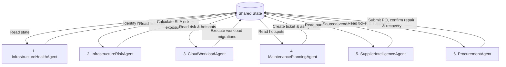

# Multi-Agent Architecture Guide - AIR-MCP

This document provides a detailed specification for the six autonomous agents running within the **AIR-MCP Multi-Agent System**.

---

## 1. Multi-Agent Collaboration Framework

The system utilizes a blackboard pattern. Each agent is a decoupled execution unit inheriting from the [BaseAgent](../../backend/app/features/workflow/agents/base.py) class. They read from and write to a shared state, collaborating sequentially to resolve infrastructure incidents.

---

## 2. Agent Catalog

### 1. InfrastructureHealthAgent
*   **Module**: [health.py](../../backend/app/features/incident/agents/health.py)
*   **Role**: Monitors datacenter telemetry, identifies thermal hotspots, and checks cooling loop health.
*   **MCP Tools Called**:
    *   `analyze_infrastructure_health` (fetches core telemetry metrics)
*   **MCP Resources Read**:
    *   `datacenter://assets/registry` (chiller health check)
    *   `datacenter://telemetry/feed` (ambient room temperature)
*   **MCP Prompt Templates Fetched**:
    *   `thermal_hotspot_investigation`
*   **State Updates**: Writes identified `hotspots` list and cooling loops status to state.

### 2. InfrastructureRiskAgent
*   **Module**: [risk.py](../../backend/app/features/incident/agents/risk.py)
*   **Role**: Assesses active workload SLA breach risks, calculates failure probabilities, and estimates financial exposure.
*   **MCP Tools Called**:
    *   `assess_operational_risk` (calculates USD financial exposure and SLA alerts)
*   **MCP Prompt Templates Fetched**:
    *   `emergency_cooling_response`
*   **State Updates**: Writes `risk_exposure_usd`, `at_risk_workloads` array, and a `migration_required` flag to state.

### 3. CloudWorkloadAgent
*   **Module**: [workload.py](../../backend/app/features/workload/agents/workload.py)
*   **Role**: Coordinates and executes hot-migrations of containerized/VM workloads to thermally safe host racks.
*   **MCP Tools Called**:
    *   `recommend_workload_migration` (queries candidate host racks)
    *   `migrate_workload` (executes physical VM/container reallocation)
*   **MCP Prompt Templates Fetched**:
    *   `workload_migration_strategy`
*   **State Updates**: Appends executed migrations to the `migrations_executed` list.

### 4. MaintenancePlanningAgent
*   **Module**: [maintenance.py](../../backend/app/features/maintenance/agents/maintenance.py)
*   **Role**: Diagnoses hardware replacement needs, schedules work orders, and assigns certified technicians.
*   **MCP Tools Called**:
    *   `plan_maintenance` (creates maintenance ticket, identifies skills)
    *   `schedule_technician` (assigns technician to ticket)
*   **MCP Resources Read**:
    *   `maintenance://technicians/registry` (queries available certified technicians)
*   **MCP Prompt Templates Fetched**:
    *   `maintenance_planning`
*   **State Updates**: Writes the active `ticket` data, selected `technician` details, and a `parts_needed` list to state.

### 5. SupplierIntelligenceAgent
*   **Module**: [supplier.py](../../backend/app/features/supplier/agents/supplier.py)
*   **Role**: Evaluates external supplier catalogues, reviews lead times/ratings, and selects optimal parts source.
*   **MCP Tools Called**:
    *   `evaluate_suppliers` (queries vendor stock catalogues)
*   **MCP Prompt Templates Fetched**:
    *   `supplier_selection`
*   **State Updates**: Writes selected `supplier` details, `procure_item` SKU, and `procure_quantity` to state.

### 6. ProcurementAgent
*   **Module**: [procurement.py](../../backend/app/features/supplier/agents/procurement.py)
*   **Role**: Coordinates the dispatch logistics, submits emergency procurement purchase orders, and confirms recovery.
*   **MCP Tools Called**:
    *   `generate_procurement_plan` (submits PO, sets delivery details)
    *   `confirm_maintenance_repair` (records repair completion, resets loop status)
    *   `validate_thermal_recovery` (verifies temperatures drop below limits)
*   **MCP Prompt Templates Fetched**:
    *   `procurement_recommendation`, `technician_dispatch`, `incident_recovery`
*   **State Updates**: Writes `procurement_status` (SUCCESS/FAILED), final `order` details, and `recovery_verified` status to state.
