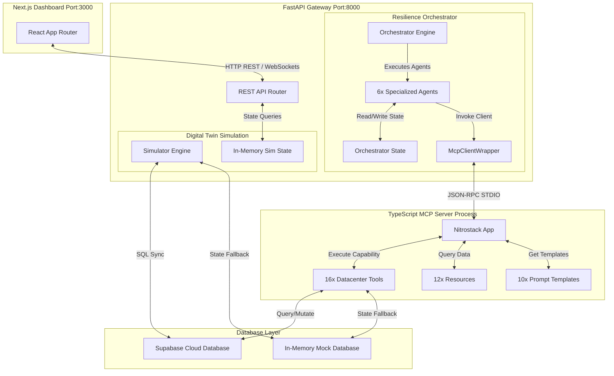
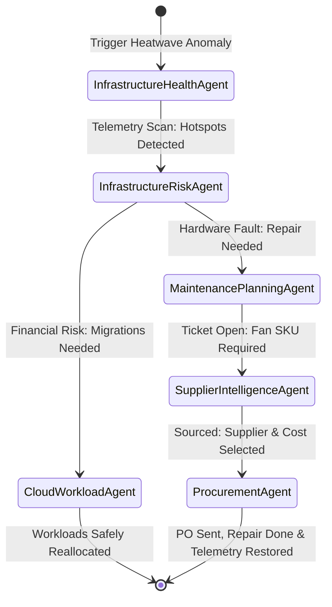

# System Architecture Guide - AIR-MCP

This document provides a technical deep dive into the architecture of the **Adaptive Infrastructure Resilience Model Context Protocol (AIR-MCP)** platform.

---

## 1. System Overview

AIR-MCP is designed as a distributed cyber-physical system. It bridges physical datacenter telemetry and workload placement with autonomous reasoning agents. The platform decouples physics simulation, multi-agent orchestrations, and API actions using the Model Context Protocol (MCP).

---

## 2. Mission Orchestrator

The **Mission Orchestrator** (implemented in [engine.py](../../backend/app/features/workflow/engine.py)) coordinates incident resolutions. When an anomaly is detected, it kicks off a four-phase resilience mission:

1.  **`HEATWAVE_TRIGGERED`**: A simulated external environment incident is injected (e.g., heatwave + cooling loop failure), forcing ambient temperatures to rise.
2.  **`THERMAL_ANALYSIS`**: Executes the `InfrastructureHealthAgent` to identify which racks exceed 35.0°C and assess cooling loop flow degradation.
3.  **`RISK_ASSESSMENT`**: Runs the `InfrastructureRiskAgent` to calculate failure probability and evaluate SLA breach risks on workloads hosted by hot racks.
4.  **`PROCUREMENT_AND_RECOVERY`**:
    *   Runs the `CloudWorkloadAgent` to migrate at-risk workloads to cooler target racks.
    *   Runs the `MaintenancePlanningAgent` to open tickets and assign qualified technicians.
    *   Runs the `SupplierIntelligenceAgent` to source replacement parts from external suppliers.
    *   Runs the `ProcurementAgent` to generate purchase orders, trigger physical repairs, and verify thermal recovery.

### Workflow Timeline

```mermaid
gantt
    title AIR-MCP Incident Orchestration Timeline
    dateFormat  s
    axisFormat %S
    
    section Trigger Phase
    Inject Heatwave & Cool Degrade :active, trigger, 0, 1s
    
    section Analysis Phase
    Scan Telemetry & Diagnose Loop  :crit, health_scan, after trigger, 1s
    
    section Risk Assessment
    Calculate SLA Risks & Exposure   :active, risk_calc, after health_scan, 1s
    
    section Mitigation & Recovery
    Migrate Workloads to Cool Racks :workloads, after risk_calc, 1.5s
    Plan Maintenance & Assign Techs :maint, after risk_calc, 1.5s
    Evaluate Supplier Stock & Lead  :supplier, after maint, 1s
    Submit Procurement PO & Repair  :procure, after supplier, 1.5s
    Verify Thermal Restoration      :crit, recovery, after procure, 1s
```

---

## 3. Digital Twin

The **Digital Twin** (implemented in [engine.py](../../backend/app/features/simulator/engine.py)) is a physics-based, stateful simulation. It models 3 Zones, 12 Racks, 48 Assets, and 96 Sensors:
*   **Heat Dynamics**: Racks calculate CPU/Memory thermal outputs based on active workloads. Ambient temperature and cooling loop flow rates determine the cooling rate.
*   **Incident Engine**: Simulates specific incident events (e.g. `HEATWAVE`, `COOLING_DEGRADATION`, `FAN_FAILURE`) that manipulate chiller efficiency or raise temperatures.
*   **Telemetry Generation**: Periodically emits telemetry metrics to `telemetry_logs`.
*   **Replay Support**: Supports resetting database scenarios to default seeded baselines to allow reproducible demonstration runs.

---

## 4. Multi-Agent System

Rather than using a single, monolithic LLM loop, AIR-MCP utilizes a **Multi-Agent System** where agents collaborate asynchronously:

*   **State Separation**: The state is recorded in a centralized [OrchestratorState](../../backend/app/features/workflow/state.py) object. Each agent executes independently and returns state delta modifications, keeping agents decoupled.
*   **Synchronous/Asynchronous Bridging**: The orchestrator wraps synchronous agent execution steps in an async executor (`_execute_agent_async`), managing time boundaries and thread concurrency.

---

## 5. Workflow Recording & Judge Mode

*   **Workflow Recording**: Every workflow run is audited. Database logs are written to `workflow_runs`, `workflow_steps`, and `decision_logs` (tracking inputs, outputs, timestamps, and LLM reasoning prompts).
*   **Judge Mode**: The frontend dashboard exposes a dedicated execution timeline allowing judges or operators to step through agent logs, view the raw JSON-RPC MCP commands exchanged, inspect database records, and verify the platform's decisions.
