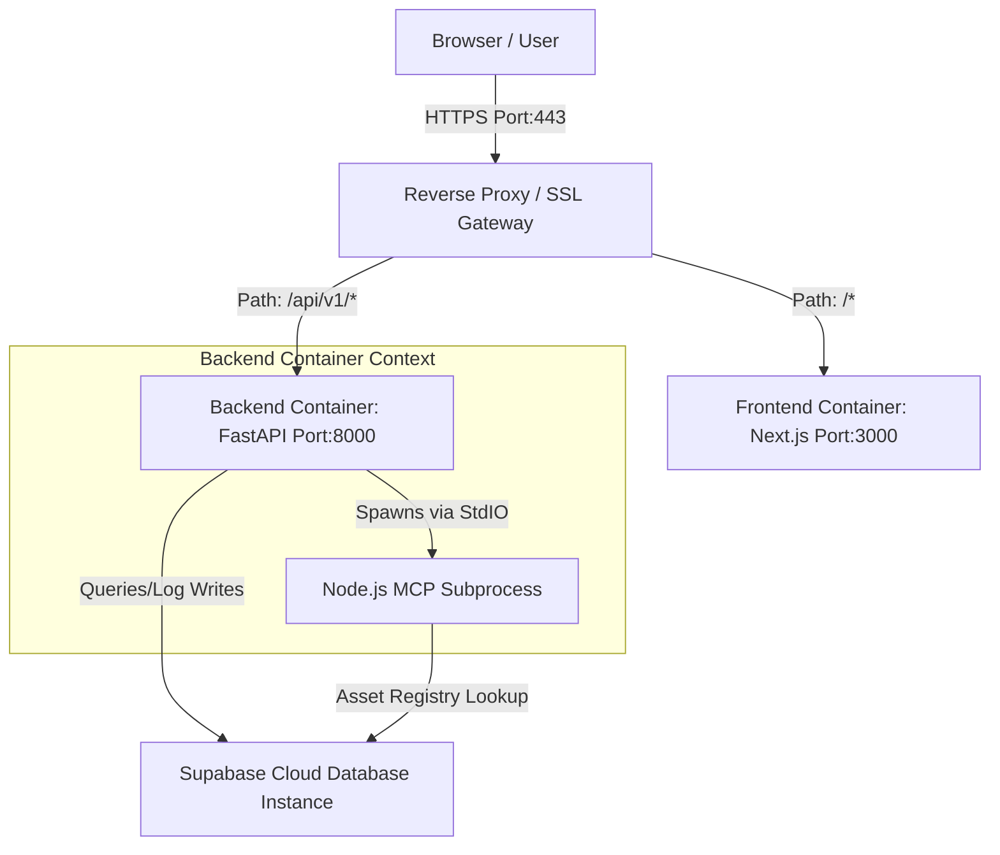

# Deployment Guide - AIR-MCP

This guide describes how to deploy the AIR-MCP platform to staging and production cloud environments.

---

## 1. Deployment Topology

The AIR-MCP platform is packaged as independent, lightweight containers. This allows it to run on standard container registries (AWS ECR, GCP Artifact Registry, GHCR) and cloud orchestration layers (Docker Compose, AWS ECS, GCP Cloud Run, or Kubernetes).



---

## 2. Environment Configurations

We define three logical deployment tiers:

| Tier | Purpose | Database Configuration | Host Environment |
| :--- | :--- | :--- | :--- |
| **Development** | Local testing, agent writing | Offline Fallback (In-memory) | Docker Compose on a local machine |
| **Staging** | CI verification, pre-demo checks | Dedicated Staging Supabase DB | AWS ECS / Render / Fly.io |
| **Production** | Live demonstration, production simulation | Dedicated Production Supabase DB | Vercel (Frontend), Railway (Backend), NitroCloud (MCP) |

---

## 3. Production Environment Variables Reference

Configure the following variables in production to ensure secure communication:

### A. Frontend (Vercel)
* `NEXT_PUBLIC_API_URL`: The URL of the production API Gateway (e.g., `https://air-mcp-production.up.railway.app/api/v1`).

### B. Backend (Railway)
* `SUPABASE_URL`: The Supabase project URL (e.g., `https://xyz.supabase.co`).
* `SUPABASE_ANON_KEY` / `SUPABASE_KEY`: The anonymous API key for database access.
* `SUPABASE_SERVICE_ROLE_KEY`: The service role API key to permit database seeding and admin actions.
* `MCP_SERVER_URL`: The public SSE URL of the hosted MCP server (e.g., `https://air-mcp-6a5b16a4-tatva-amrita-university-amritapuri-campus.app.nitrocloud.ai/sse`).
* `FRONTEND_URL`: The production frontend URL (e.g., `https://air-mcp.vercel.app`) to restrict CORS access.

### C. MCP Server (NitroCloud)
* `BACKEND_URL`: The URL of the backend (e.g., `https://air-mcp-production.up.railway.app`) to sync digital twin state telemetry.
* `PORT`: SSE listening port (typically `3000`).
* `HOST`: Bind host (typically `0.0.0.0`).
* `NODE_ENV`: Set to `production`.
* `MCP_TRANSPORT_TYPE`: Set to `dual` or `http` for SSE.

---

## 4. Database Provisioning (Supabase Cloud Setup)

The database layer requires PostgreSQL running on Supabase. Follow these steps:

### Step A: Create a Supabase Project
1. Log in to [Supabase Console](https://supabase.com).
2. Click **New Project** and configure your organization, project name (`AIR-MCP-Prod`), and region.
3. Save the **Database Password** securely.

### Step B: Run Migration Schema
1. In your Supabase dashboard, navigate to the **SQL Editor**.
2. Click **New Query**.
3. Copy the entire SQL contents from the migration file: [20260718000000_init_schema.sql](../../supabase/migrations/20260718000000_init_schema.sql) and click **Run**.
4. This compiles the 18 schema tables, composite indexes, and auto-updated timestamp triggers.

### Step C: Seed Demo Data
1. In the **SQL Editor**, click **New Query** again.
2. Copy the entire SQL contents from [seed.sql](../../supabase/seed.sql) and click **Run**.
3. This seeds the system baseline: 3 Zones, 12 Racks, 48 Assets, 96 Sensors, 20 Workloads, 10 Technicians, 30 Inventory Items, 8 Suppliers, and historical incident history.

### Step D: Retrieve API Credentials
1. Navigate to **Project Settings** > **API**.
2. Copy the following keys for your env setup:
   * **Project URL** (maps to `SUPABASE_URL` in `.env`)
   * **service_role API Key** (maps to `SUPABASE_KEY` in `.env`) - *Note: The service_role key is required to allow the backend bypass RLS constraints for system logs.*

---

## 5. Container Compilation & Registry Pushing

### A. Backend Container (FastAPI + Embedded MCP)
The backend container packages both the FastAPI python app and the Node.js TypeScript MCP server. The Node server is compiled during container build and run as a subprocess.
1. Build the backend image:
   ```bash
   docker build -t air-mcp-backend:latest -f ./backend/Dockerfile .
   ```
2. Tag and push to your container registry:
   ```bash
   docker tag air-mcp-backend:latest <registry_uri>/air-mcp-backend:latest
   docker push <registry_uri>/air-mcp-backend:latest
   ```

### B. Frontend Container (Next.js Standalone)
The Next.js frontend runs as a separate container. Build the container by passing the production API Gateway URL as a build argument:
1. Build the frontend image:
   ```bash
   docker build -t air-mcp-frontend:latest -f ./frontend/Dockerfile --build-arg NEXT_PUBLIC_API_URL=https://<your-backend-domain>/api/v1 ./frontend
   ```
2. Tag and push to your container registry:
   ```bash
   docker tag air-mcp-frontend:latest <registry_uri>/air-mcp-frontend:latest
   docker push <registry_uri>/air-mcp-frontend:latest
   ```

---

## 6. CI/CD Pipeline (GitHub Actions)

We implement a complete CI/CD configuration inside [.github/workflows/ci-cd.yml](../../.github/workflows/ci-cd.yml) which executes on every push or pull request to the `main` branch.

### Pipeline Stages:
1.  **`Lint & Typecheck`**:
    *   Python formatting is checked via `black --check backend/app/`.
    *   Python syntax limits are checked via `flake8 backend/app/ --select=E9,F63,F7,F82`.
    *   Frontend type checks are verified via `npx tsc --noEmit` under `/frontend`.
    *   MCP server type checks are verified via `npx tsc --noEmit` under `/mcp-server`.
2.  **`Backend Unit Tests`**:
    *   Installs dependencies and runs the Pytest suite (`pytest` in `/backend`).
3.  **`Verify Docker Builds`**:
    *   Builds backend, frontend, and standalone MCP images locally inside the runner context to verify Docker compatibility and prevent compilation crashes.
