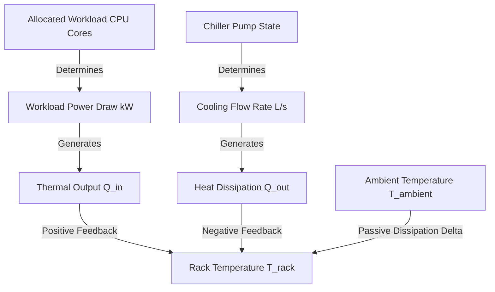

# Digital Twin & Simulation Guide - AIR-MCP

This document explains the physics-based mathematical models, telemetry configurations, and incident engines that make up the **AIR-MCP Digital Twin** (implemented in [engine.py](../../backend/app/features/simulator/engine.py)).

---

## 1. Physical Simulation Model

The Digital Twin simulates thermodynamics and workload power requirements within a multi-zone data center layout. Rather than relying on simple randomized metrics, rack temperatures are calculated on every simulation tick using physical thermal equations.

### Thermodynamic Equation
The rack temperature \(T_t\) at tick \(t\) is calculated as:
\[T_{t} = T_{t-1} + \Delta T_{power} - \Delta T_{cooling} + \Delta T_{ambient}\]

Where:
*   **Heat Generation (\(\Delta T_{power}\))**: Calculated from active workload allocations:
    \[\Delta T_{power} = \alpha \times \sum (Power_{workload})\]
    *Where \(\alpha\) is the heating coefficient (defaults to 0.08) and \(Power_{workload}\) is workload power draw in kW.*
*   **Heat Dissipation (\(\Delta T_{cooling}\))**: Calculated from active cooling flow:
    \[\Delta T_{cooling} = \beta \times Flow_{rate} \times Efficiency_{chiller}\]
    *Where \(\beta\) is the cooling dissipation coefficient (defaults to 0.12), \(Flow_{rate}\) is cooling loop liters-per-second, and \(Efficiency_{chiller}\) is chiller health efficiency (0.0 to 1.0).*
*   **Ambient Passive Delta (\(\Delta T_{ambient}\))**: Models passive thermal transfer from ambient air:
    \[\Delta T_{ambient} = \gamma \times (T_{ambient} - T_{t-1})\]
    *Where \(\gamma\) is the heat dissipation rate (defaults to 0.02) and \(T_{ambient}\) is room ambient temperature (typically 22-24°C).*

---

## 2. Telemetry Architecture

Every active server rack generates telemetry metrics. Telemetry is collected by simulated sensor networks:
*   **Thermal Sensors**: Track rack core temperature and ambient temperature.
*   **Flow Sensors**: Track chiller cooling pump output flow rates (L/s).
*   **Compute Sensors**: Track active vCPU allocations and RAM utilization.
*   **Power Sensors**: Track power consumption (kW) against maximum rack safety ratings.

Telemetry is written directly to the `telemetry_logs` database table on every tick. The frontend polls these metrics to render live status widgets.

---

## 3. Incident Engine & Scenarios

The incident engine supports injecting physical faults to test agent resilience:

*   **`HEATWAVE`**: Raises the ambient temperature \(T_{ambient}\) from 24°C to 42°C. This reduces passive dissipation and drives rack temperatures up.
*   **`COOLING_DEGRADATION`**: Simulates chiller pump leaks. Reduces chiller flow rate \(Flow_{rate}\) to 1.2 L/s and chiller efficiency to 0.40.
*   **`FAN_FAILURE`**: Simulates a physical cooling fan failure. Causes a sudden, concentrated temperature spike on the affected rack (typically exceeding 38°C).
*   **`POWER_SURGE`**: Temporarily spikes power draws on affected rows, testing the backup UPS batteries.

When an incident is injected (via the REST endpoint `/api/v1/simulator/incident`), the simulation state variables are modified, causing temperatures to rise and trigger agent checks on subsequent ticks.

---

## 4. Replay Support & Resets

For live demonstration runs, the simulator supports complete scenario resets:
*   **API Trigger**: `/api/v1/simulator/reset` (POST).
*   **Action**: Shuts down the background loop, drops active incident states, resets rack temperatures to default operational baselines (22.5°C), updates all workloads back to their original host racks, and syncs the reset state to the database layer. This ensures that the presenter can rerun the demonstration multiple times with identical, reproducible results.
