# UX Architecture & Design Specification: AIR-MCP (Adaptive Infrastructure Resilience MCP)

This document establishes the UX Architecture, Design System, Interaction Patterns, and presentation-layer enhancements for AIR-MCP, an autonomous decision orchestration platform for AI Data Center Infrastructure & Smart Grid Resilience.

---

## 1. Information Architecture & Navigation

The platform is structured to support instant situational awareness for operations and technical deep dives for engineers.

```mermaid
graph TD
    App[AIR-MCP Platform] --> Nav[Global Navigation System]
    
    Nav --> Dash[1. Dashboard]
    Dash --> Overview[High-Level Status Metrics]
    Dash --> MiniTwin[Miniature Digital Twin Overview]
    Dash --> ActiveInc[Active Incidents Feed]
    Dash --> AgentSummary[Agent Activity Card]
    
    Nav --> Twin[2. Digital Twin]
    Twin --> Map[3D/2D Topology Map]
    Twin --> Telemetry[Real-time Asset Metrics]
    Twin --> OverlayControls[Layer Toggles: Power, Cooling, Compute]
    
    Nav --> Incident[3. Incident Center]
    Incident --> IncList[Incident Queue]
    Incident --> IncDetail[Incident Details & Blast Radius]
    Incident --> RecoveryPlan[Active Recovery Plan Orchestrator]
    
    Nav --> Orchestrator[4. Mission Orchestrator]
    Orchestrator --> AgentPool[Active Agent Directory]
    Orchestrator --> MCPConsole[MCP Resource Panel]
    Orchestrator --> RunHistory[Workflow Run Logs]
    
    Nav --> Workflow[5. Workflow Timeline]
    Workflow --> StepVisualizer[Incident-to-Restoration Chronology]
    Workflow --> StepTelemetry[Tool & Prompt Metrics]
    
    Nav --> Inventory[6. Inventory & Suppliers]
    Inventory --> Spares[Critical Spares Tracker]
    Inventory --> VendorSLA[Supplier Delivery & SLAs]
    
    Nav --> Admin[7. Governance & Audit]
    Admin --> AudLogs[Immutable Audit History]
    Admin --> PlatformSettings[System Settings]
    
    Nav --> Judge[8. Judge Mode / Presentation Overlay]
    Judge --> ScenarioSelector[Demo Trigger Controls]
    Judge --> StepNarrator[CTO Presentation Overlay]
```



### Navigation Paradigm
- **Global Left Navigation Sidebar**: Collapsible. Icons with text labels. 
- **Top Utility Header**: Platform Health Status Indicator (Green/Amber/Red), Current Time (UTC/Local), Active Session Status, and the **"Judge Mode" Global Toggle**.
- **Contextual Side Panels (Drawers)**: Used for details on nodes, agents, or tools to keep users in their primary context without losing focus.

---

## 2. Design System & Visual Guidelines

### 2.1 Color Palette (Enterprise Dark Mode)
To reduce eye strain in 24/7 Operations Centers and create a premium, high-trust feel, a dark UI theme is specified. Colors represent state cleanly without reliance on hue alone.

| Token | CSS Value / Variable | Usage | Description |
| :--- | :--- | :--- | :--- |
| `bg-primary` | `hsl(220, 20%, 8%)` | Main background | Ultra-dark slate |
| `bg-secondary` | `hsl(220, 16%, 12%)` | Cards, side panels | Dark charcoal-slate |
| `bg-tertiary` | `hsl(220, 14%, 18%)` | Borders, hover states | Charcoal |
| `border-subtle` | `hsl(220, 12%, 22%)` | Division lines, containers | Muted grey-blue |
| `text-primary` | `hsl(0, 0%, 98%)` | Headers, primary labels | High-contrast off-white |
| `text-secondary`| `hsl(220, 10%, 75%)` | Body copy, descriptions | Muted grey |
| `text-muted` | `hsl(220, 10%, 50%)` | Metadata, timestamps | Low-priority text |
| `status-ok` | `hsl(150, 84%, 42%)` | Normal state, success | Emerald green (high legibility) |
| `status-warn` | `hsl(38, 92%, 50%)` | Warning, degraded | Amber gold |
| `status-error` | `hsl(0, 84%, 60%)` | Incident, failure | Vibrant crimson red |
| `status-info` | `hsl(210, 100%, 60%)` | Active agent, tool running | Cobalt blue |
| `accent-primary`| `hsl(255, 85%, 65%)` | Highlights, CTA, AI tags | Electric violet |

### 2.2 Typography Scale
- **Primary Sans-Serif Font**: `Outfit` or `Inter` (Clean, highly legible geometric sans-serif).
- **Monospace Font** (for MCP resources, logs, token sizes): `JetBrains Mono` or `Fira Code`.

| CSS Rule | Size | Weight | Line Height | Usage |
| :--- | :--- | :--- | :--- | :--- |
| `font-h1` | `24px (1.5rem)` | Bold (700) | `32px` | Primary Screen Headers |
| `font-h2` | `20px (1.25rem)`| Semi-Bold (600) | `28px` | Card Titles, Section Headers |
| `font-h3` | `16px (1.05rem)`| Medium (500) | `24px` | Subsection Headers |
| `font-body` | `14px (0.875rem)`| Regular (400) | `20px` | General Body Text, Labels |
| `font-mono` | `12px (0.75rem)` | Regular (400) | `18px` | Telemetry logs, Prompts, Code |
| `font-small` | `12px (0.75rem)` | Regular (400) | `16px` | Metadata, timestamps |

### 2.3 Spacing Scale (4px Base Grid)
- `space-xxs`: `4px`
- `space-xs`: `8px` (Inner padding of badges, small gaps)
- `space-sm`: `12px` (Spacing between adjacent form elements, label-to-input gap)
- `space-md`: `16px` (Standard card padding, medium component gaps)
- `space-lg`: `24px` (Section padding, spacing between cards)
- `space-xl`: `32px` (Main container padding)

---

## 3. Screen Designs & Layouts

### 3.1 Digital Twin & Topology Map
The Digital Twin must communicate the state of the infrastructure instantly.

```
+-----------------------------------------------------------------------------------+
|  [Global Header: Platform Health: DEGRADED]           [Judge Mode Toggle: ON]     |
+-----------------------------------------------------------------------------------+
|  DIGITAL TWIN TOPOLOGY                                         [Layer Toggle v]   |
|                                                                                   |
|  +--------------------------------------------------+  +------------------------+ |
|  | [3D/2D TOPOLOGY CANVAS]                          |  | SELECTED ASSET DETAILS | |
|  |                                                  |  | Name: Transformer T-04 | |
|  |   (Grid Substation A)                            |  | Status: CRITICAL       | |
|  |     [Node: Gen-1] -- (Ok) -- [Substation-A]      |  | Temp: 114°C (Limit: 95)| |
|  |                                  |               |  | Load: 118% (Overload)  | |
|  |                                (Error)           |  |                        | |
|  |                                  |               |  | Active Agent:          | |
|  |                             [X - Trans-04]       |  | Grid Resiliency Agent  | |
|  |                                  |               |  |                        | |
|  |                                (Degraded)        |  | Actions Executing:     | |
|  |                                  |               |  | -> Redirect power path | |
|  |                              [Rack-Row-12]       |  | -> Spin up battery bank| |
|  |                                                  |  |                        | |
|  |  [+] Live Telemetry Overlay  [✔] Compute Layer   |  | [View Run Log]         | |
|  |  [-] Auto-Center View        [✔] Power Grid Layer|  | [Override Command]     | |
|  +--------------------------------------------------+  +------------------------+ |
|                                                                                   |
|  TELEMETRY SPARKLINE                                                              |
|  Grid Load:  ~~~~\___ (Avg: 85%)     Chilled Water Temp: __/\___ (Avg: 12.8°C)    |
+-----------------------------------------------------------------------------------+
```

#### Key Elements of the Digital Twin Map:
1. **Dynamic Visual Indicators**:
   - **Nodes**: High-contrast geometric shapes (circles for grid substations, squares for cooling loops, server icons for racks).
   - **Links**: Animated directional "pulses" representing flow rate/load. If a link is overloaded, its color shifts to Amber or Crimson. If severed, it shows as a dotted grey line.
2. **Blast Radius Ring**: A soft red radial gradient surrounding critical assets (e.g., failed transformers) representing the affected zone and downstream dependent assets.
3. **Recovery Progress Bar**: Rendered directly on the map, illustrating the state of active routing adjustments or cooling cycles initiated by the agents.

---

### 3.2 Signature Experience: Workflow Timeline
This visualization explains the orchestrator's decision-making flow from trigger to final verification.

```
[ Incident Trigger ] ===> [ Agent Dispatch ] ===> [ MCP Capability Usage ] ===> [ Recovery Plan ] ===> [ Verification & Health OK ]
(Over-temp detected)     (Risk Agent active)     (Switch Power Tool run)       (Load Shed & Reroute)    (SLA Targets restored)
      10:01:05                  10:01:12                10:01:25                     10:02:10                  10:03:00
         |                         |                       |                            |                         |
         v                         v                       v                            v                         v
   [Telemetry Log]           [Confidence: 94%]       [MCP: grid-api/route]       [Cost-Benefit Calc]       [Audit Trail Written]
```

#### Detailed Timeline Nodes:
1. **Trigger Card**:
   - Time, Source (e.g., SCADA system or Prometheus), Severity (Critical).
2. **Agent Coordination Card**:
   - Shows which agents were instantiated (e.g., Grid Resiliency Agent, Infrastructure Risk Agent).
   - High-contrast visual representation of confidence scores (e.g., `Confidence: 96%` displayed in a radial gauge).
3. **MCP Access Card**:
   - Names the specific MCP Tool invoked: `grid-mcp-server/transfer_load`.
   - Explains the target resource: `uri: "co-location/row-12/pdu-b"`.
   - Displays the execution duration (e.g., `214ms`) and prompt context.
4. **Decision & Path Optimization**:
   - Shows the alternative actions evaluated by the agent (e.g., Action A: Shed load [Estimated downtime: 45 min], Action B: Reroute load [Estimated downtime: 0 min, cost: +$450]).
   - Explains why the agent picked Action B (Autonomous Decision Justification).
5. **Execution Plan & Recovery**:
   - Live checklists that update dynamically as recovery commands complete.
6. **Restoration Verification**:
   - Post-event health check logging. Verification of system metrics returning to nominal limits.

---

### 3.3 Agent Experience Card
Each autonomous agent is represented as a structured card in the interface.

```
+--------------------------------------------------------+
|  [🤖] GRID RESILIENCY AGENT             [Status: ACTIVE] |
+--------------------------------------------------------+
|  Responsibility: Load balancing & substation switching |
|  Current Task: Transferring 4.2MW from Sub-04 to Sub-08|
|                                                        |
|  Execution Confidence:                                 |
|  [=======================>    ] 88%                    |
|  Reasoning: Substation 08 has 6.1MW surplus capacity.   |
|                                                        |
|  Last Action: Invoked MCP tool 'grid-control/switch'   |
|  Execution Time: 12s (Total Active: 1m 45s)            |
+--------------------------------------------------------+
```

---

### 3.4 MCP (Model Context Protocol) Console Screen
This screen reinforces the platform's architectural foundation: that MCP is the mechanism enabling the AI models to read telemetry and manipulate physical infrastructure.

- **Registered Servers List**: Displays connected MCP servers (`grid-mcp-server`, `cooling-mcp-server`, `inventory-mcp-server`).
- **Tool Inventory**: A catalog of available tools (e.g., `isolate_node()`, `get_thermal_telemetry()`, `dispatch_technician()`).
- **Live Tool Activity Log**: A streaming table showing real-time MCP API calls:
  - `Timestamp` | `MCP Server` | `Tool Invoked` | `Input Parameters` | `Output Result` | `Latency` | `Status (Success/Fail)`
- **Resource Templates Viewer**: Text area displaying Prompt Templates loaded from the MCP servers.

---

## 4. Interaction Specifications & Motion Guidelines

Interaction transitions must feel instantaneous, solid, and reliable. Avoid sluggish animations.

### 4.1 Transitions & Timing
- **Card Hover**: Elevate card with a subtle shadow shift and a `1px` border glow transition.
  - CSS: `transition: border-color 150ms ease, box-shadow 150ms ease;`
- **Side Panel Slide-In**: Slide-in from right.
  - CSS: `transition: transform 250ms cubic-bezier(0.16, 1, 0.3, 1);`
- **Timeline Pulse**: Active timeline steps animate with a soft, periodic breathing pulse (opacity shifts from `0.6` to `1.0` every `2s`) on their border or status dot to indicate active execution.

### 4.2 Judge Mode / Presentation Overlay Design
The **Presentation Overlay** acts as a live narrator for the judges.

- **UI Implementation**: A semi-transparent overlay banner placed at the bottom or top of the screen.
- **Toggle**: A prominent violet toggle `[💡 Presentation Mode]` is anchored in the top utility header.
- **Overlay Layout**:
  - Left Section: **Current Demonstration Phase** (e.g., "Phase 2/5: Risk Analysis").
  - Center Section: **Narrative Text** in large, high-readability text ("The system detected an over-temperature event. The Risk Mitigation Agent is calculating downstream impact using the MCP Tool `calculate_blast_radius`.").
  - Right Section: **Controls** (`[Prev Phase]` `[Next Phase]` `[Pause Auto-Play]`).

---

## 5. Accessibility Checklist

- [ ] **Contrast Compliance**: Ensure text contrast ratio exceeds 4.5:1 for body copy and 3.0:1 for headers.
- [ ] **Color-Blind Friendly Statuses**: Do not rely on color alone to communicate state. Include clear icons (e.g., checkmark for OK, warning triangle for WARN, cross inside red circle for ERROR).
- [ ] **Keyboard Navigation**: Complete tab order index defined for all interactive buttons, cards, and toggle switches.
- [ ] **Screen Reader Labels**: Provide clear aria-labels on data-heavy elements and visualization steps (e.g. `aria-label="Agent Resiliency Agent, active with 88% confidence"`).

---

## 6. UX Architecture Rationale & Trade-offs

- **Dark Mode vs. Light Mode**: A high-contrast dark theme was selected. While light themes are often easier to read in bright rooms, control room displays and operations centers almost exclusively leverage dark modes to prevent long-shift fatigue and highlight alerts immediately.
- **Topology Detail Density**: We prioritize a simplified logical map over a literal geographic map for the Digital Twin. While geolocations look complex, they obscure the *dependencies* and *flow directions* of load transfer, which are critical to explaining autonomous orchestration quickly.
- **Narrator Overlay vs. Static Tooltips**: Hover-based tooltips fail in a live demonstration because the presenter has to constantly move the mouse pointer. The presentation overlay narrator is globally anchored and auto-advances, ensuring judges don't miss key events.
