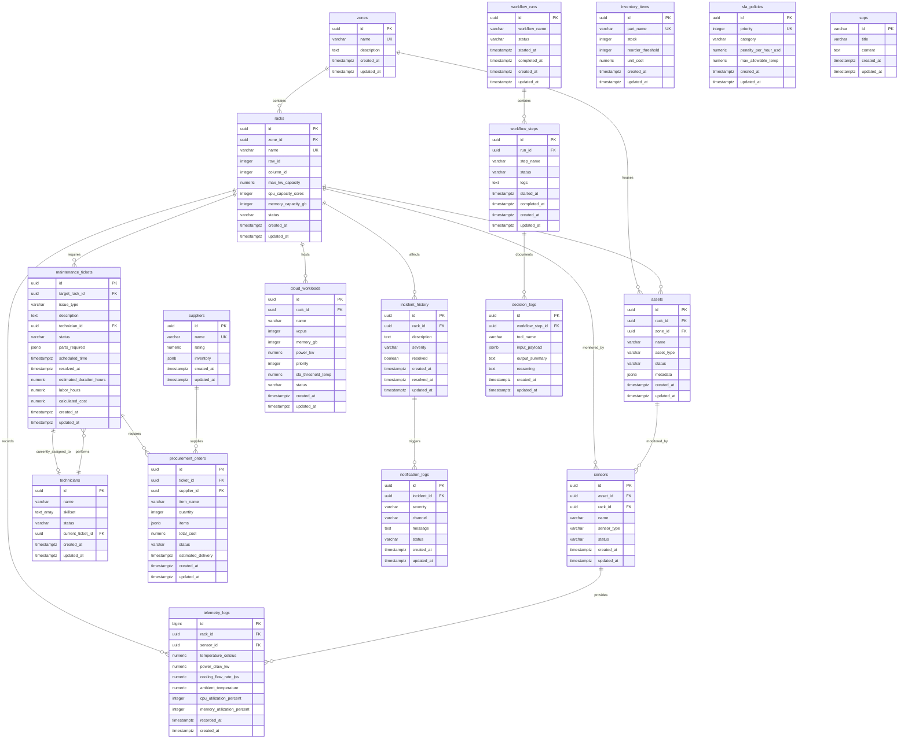

# AIR-MCP Entity Relationship Diagram (ERD)

This document contains the Entity Relationship Diagram for the AIR-MCP Supabase PostgreSQL database schema.

```mermaid
erDiagram
    zones ||--o{ racks : "contains"
    zones ||--o{ assets : "houses"
    racks ||--o{ assets : "contains"
    racks ||--o{ sensors : "monitored_by"
    assets ||--o{ sensors : "monitored_by"
    racks ||--o{ telemetry_logs : "records"
    sensors ||--o{ telemetry_logs : "provides"
    racks ||--o{ incident_history : "affects"
    racks ||--o{ maintenance_tickets : "requires"
    racks ||--o{ cloud_workloads : "hosts"
    
    technicians ||--o{ maintenance_tickets : "performs"
    maintenance_tickets ||--o| technicians : "currently_assigned_to"
    
    maintenance_tickets ||--o{ procurement_orders : "requires"
    suppliers ||--o{ procurement_orders : "supplies"
    
    workflow_runs ||--o{ workflow_steps : "contains"
    workflow_steps ||--o{ decision_logs : "documents"
    
    incident_history ||--o{ notification_logs : "triggers"

    zones {
        uuid id PK
        varchar name UK
        text description
        timestamptz created_at
        timestamptz updated_at
    }

    racks {
        uuid id PK
        uuid zone_id FK
        varchar name UK
        integer row_id
        integer column_id
        numeric max_kw_capacity
        integer cpu_capacity_cores
        integer memory_capacity_gb
        varchar status
        timestamptz created_at
        timestamptz updated_at
    }

    assets {
        uuid id PK
        uuid rack_id FK
        uuid zone_id FK
        varchar name
        varchar asset_type
        varchar status
        jsonb metadata
        timestamptz created_at
        timestamptz updated_at
    }

    sensors {
        uuid id PK
        uuid asset_id FK
        uuid rack_id FK
        varchar name
        varchar sensor_type
        varchar status
        timestamptz created_at
        timestamptz updated_at
    }

    telemetry_logs {
        bigint id PK
        uuid rack_id FK
        uuid sensor_id FK
        numeric temperature_celsius
        numeric power_draw_kw
        numeric cooling_flow_rate_lps
        numeric ambient_temperature
        integer cpu_utilization_percent
        integer memory_utilization_percent
        timestamptz recorded_at
        timestamptz created_at
    }

    incident_history {
        uuid id PK
        uuid rack_id FK
        text description
        varchar severity
        boolean resolved
        timestamptz created_at
        timestamptz resolved_at
        timestamptz updated_at
    }

    workflow_runs {
        uuid id PK
        varchar workflow_name
        varchar status
        timestamptz started_at
        timestamptz completed_at
        timestamptz created_at
        timestamptz updated_at
    }

    workflow_steps {
        uuid id PK
        uuid run_id FK
        varchar step_name
        varchar status
        text logs
        timestamptz started_at
        timestamptz completed_at
        timestamptz created_at
        timestamptz updated_at
    }

    decision_logs {
        uuid id PK
        uuid workflow_step_id FK
        varchar tool_name
        jsonb input_payload
        text output_summary
        text reasoning
        timestamptz created_at
        timestamptz updated_at
    }

    technicians {
        uuid id PK
        varchar name
        text_array skillset
        varchar status
        uuid current_ticket_id FK
        timestamptz created_at
        timestamptz updated_at
    }

    maintenance_tickets {
        uuid id PK
        uuid target_rack_id FK
        varchar issue_type
        text description
        uuid technician_id FK
        varchar status
        jsonb parts_required
        timestamptz scheduled_time
        timestamptz resolved_at
        numeric estimated_duration_hours
        numeric labor_hours
        numeric calculated_cost
        timestamptz created_at
        timestamptz updated_at
    }

    inventory_items {
        uuid id PK
        varchar part_name UK
        integer stock
        integer reorder_threshold
        numeric unit_cost
        timestamptz created_at
        timestamptz updated_at
    }

    suppliers {
        uuid id PK
        varchar name UK
        numeric rating
        jsonb inventory
        timestamptz created_at
        timestamptz updated_at
    }

    procurement_orders {
        uuid id PK
        uuid ticket_id FK
        uuid supplier_id FK
        varchar item_name
        integer quantity
        jsonb items
        numeric total_cost
        varchar status
        timestamptz estimated_delivery
        timestamptz created_at
        timestamptz updated_at
    }

    cloud_workloads {
        uuid id PK
        uuid rack_id FK
        varchar name
        integer vcpus
        integer memory_gb
        numeric power_kw
        integer priority
        numeric sla_threshold_temp
        varchar status
        timestamptz created_at
        timestamptz updated_at
    }

    sla_policies {
        uuid id PK
        integer priority UK
        varchar category
        numeric penalty_per_hour_usd
        numeric max_allowable_temp
        timestamptz created_at
        timestamptz updated_at
    }

    sops {
        varchar id PK
        varchar title
        text content
        timestamptz created_at
        timestamptz updated_at
    }

    notification_logs {
        uuid id PK
        uuid incident_id FK
        varchar severity
        varchar channel
        text message
        varchar status
        timestamptz created_at
        timestamptz updated_at
    }
```
